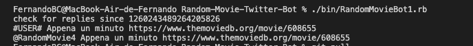
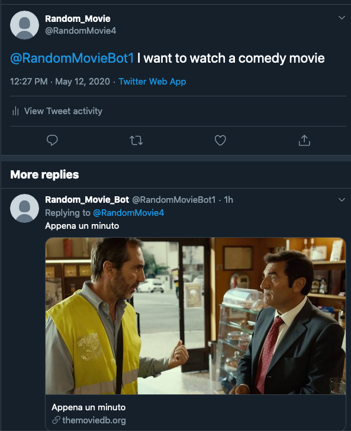
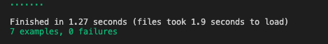

# Ruby Capstone Project: Random-Movie-Twitter-Bot
A Twitter bot that recommends a movie based on the genre that the user tweets

> This project consists of building a twitter bot that replies to the user with a movie recommendation based on the genre of the movie that the user tweets.


# This project delivers on the following basic specifications
- When locally executed, the program checks if the user twitter handler has been mentioned and checks the user's reply_id to see if this tweet has been already answered.
- Reads the tweet text and run the helper and genres method to check if there is mention to any valid movie genres, contained in The Movie Database.
- If the tweet text contained a valid genre, the bot searches the Movie Database for a random page of the requested genre and selects a random movie from the page.
- The bot then gets the title and the id of the selected movie.
- Finally the title movie and the link with the correspondent id is replied to the user. 

## Built With

- Ruby
- Stickler
- Rubocop
- Rspec
- VS Code
- Chatterbox

## Getting Started

To get a local copy up and running follow these steps.

### Prerequisites
To deploy a fully functional local copy, you must install the following dependencies/libraries: 
- [Chatterbox](https://github.com/muffinista/chatterbot) Wrapper used to interact with the twitter API
- [The Movie DB](https://github.com/ahmetabdi/themoviedb/) Wrapper used to interact with the TMDB API
- [Dotenv](https://github.com/bkeepers/dotenv) Used for handling environmental variables

### Setup
- Clone this repository in your local environment
- Located on the root of repository execute 

 ```bundle install``` 
 
 This will install all the required dependencies. 

 See the details below to modify and include all your personal  keys and values in the .yml and .env files
 
## Adding Keys

### TMDB Key 

- Inside the ```.env``` file on the root of your project and add your own TMDB API key. You can request one here (https://www.themoviedb.org/documentation/api)

```ruby

export TMBD_KEY = WRITE YOUR TMBD API KEY HERE

```

### Twitter keys

- At the ```.RandomMovieBot1.yml``` file, located in the bin folder you have to add your own twitter development consumer/access key/secret/tokens from your twitter developer account.

You can request one here:

[Link for Twitter development account creation](https://developer.twitter.com/en/apply-for-access)

```ruby
:consumer_key: --WRITE YOUR TWITTER CONSUMER_KEY HERE--
:consumer_secret: --WRITE YOUR TWITTER CONSUMER_SECRET HERE--
:access_token: --WRITE YOUR TWITTER ACCESS_TOKEN HERE--
:access_token_secret: --WRITE YOUR TWITTER ACCESS_TOKEN_SECRET HERE--
```

## Usage
- To start using the program, go to any twitter account and tweet ```@RandomMovieBot1 -- text asking for a movie of X genre --```
for example you can tweet ```@RandomMovieBot1 I want to watch an action movie```
- Then using your terminal navigate to your project folder and execute the bot with the ```./bin/RandomMovieBot1.rb``` command
- You should see in the terminal output the twitter handler of the user the bot is replying, the title of the movie and the link to the movie database film page



- Now go to the twitter account who twitted and you should see the original tweet has been replied with a movie suggestion of the requested genre



## RSpec Testing

The code can be tested using RSpec. To run the tests first make sure you have RSpec installed on your local machine. To verify it open your terminal and type:

```rspec --version```

If it is not installed, you can do it running the following command:

```gem install rspec```

To run the tests, navigate to the root file of the project and run:

```rspec```

 The tests output should be like this:



If you prefer to run your own tests, feel free to modify these files from the ```./spec``` folder, according to your criteria:

```genres_spec.rb
   helper_methods_spec.rb
   movies_spec.rb
```


## Deployment

For further testing purposes, this bot could be deployed in a server using Heroku.

## Author

👤 **Fernando Bahamondes**

- Github: [@ferbaco86](https://github.com/ferbaco86)
- Twitter: [@ferbac0](https://twitter.com/ferbac0)
- Linkedin: [Fernando Bahamondes](https://www.linkedin.com/in/fernando-bahamondes-correa)

## 🤝 Contributing

Contributions, issues and feature requests are welcome!

Feel free to check the [issues page](https://github.com/ferbaco86/Random-Movie-Twitter-Bot/issues).

## Show your support

Give a ⭐️ if you like this project!


## 📝 License

This project is [MIT](https://github.com/ferbaco86/Random-Movie-Twitter-Bot/blob/twitter-bot/LICENSE) licensed.
